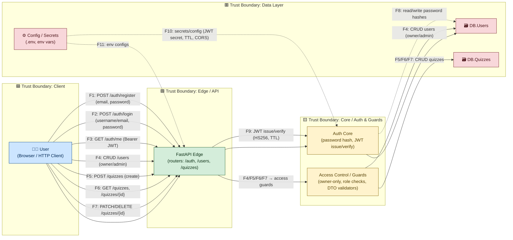

# Data Flow Diagram (DFD) — Quiz Builder

> Границы доверия: Client → Edge/API → Core/Auth → Data

```mermaid
flowchart LR
%% ===========================
%% Data Flow Diagram (DFD) — Quiz Builder
%% ===========================

%% ---------- Trust Boundaries ----------
subgraph TB1["🟦 Trust Boundary: Client"]
  E1["🧑‍💻 User<br>(Browser / HTTP Client)"]
end

subgraph TB2["🟩 Trust Boundary: Edge / API"]
  P1["FastAPI Edge<br>(routers: /auth, /users, /quizzes)"]
end

subgraph TB3["🟨 Trust Boundary: Core / Auth & Guards"]
  P2["Auth Core<br>(password hash, JWT issue/verify)"]
  P3["Access Control / Guards<br>(owner-only, role checks, DTO validators)"]
end

subgraph TB4["🟥 Trust Boundary: Data Layer"]
  D1["🗃️ DB.Users"]
  D2["🗃️ DB.Quizzes"]
  C1["⚙️ Config / Secrets<br>(.env, env vars)"]
end

%% ---------- Data Flows ----------
E1 -->|"F1: POST /auth/register (email, password)"| P1
E1 -->|"F2: POST /auth/login (username/email, password)"| P1
E1 -->|"F3: GET /auth/me (Bearer JWT)"| P1
E1 -->|"F4: CRUD /users (owner/admin)"| P1
E1 -->|"F5: POST /quizzes (create)"| P1
E1 -->|"F6: GET /quizzes, /quizzes/{id}"| P1
E1 -->|"F7: PATCH/DELETE /quizzes/{id}"| P1

P1 -->|"F9: JWT issue/verify (HS256, TTL)"| P2
P1 -->|"F4/F5/F6/F7 → access guards"| P3

P2 -.->|"F8: read/write password hashes"| D1
P3 -->|"F4: CRUD users (owner/admin)"| D1
P3 -->|"F5/F6/F7: CRUD quizzes"| D2

C1 -.->|"F10: secrets/config (JWT secret, TTL, CORS)"| P2
C1 -.->|"F11: env configs"| P1

%% ---------- Styles ----------
classDef client fill:#cce5ff,stroke:#004085,color:#002752;
classDef api fill:#d4edda,stroke:#155724,color:#0b2e13;
classDef core fill:#fff3cd,stroke:#856404,color:#533f03;
classDef data fill:#f8d7da,stroke:#721c24,color:#491217;

class E1 client;
class P1 api;
class P2,P3 core;
class D1,D2,C1 data;

%% ---------- Layout tweaks ----------
E1 --> P1 --> P2 --> D1;

```
